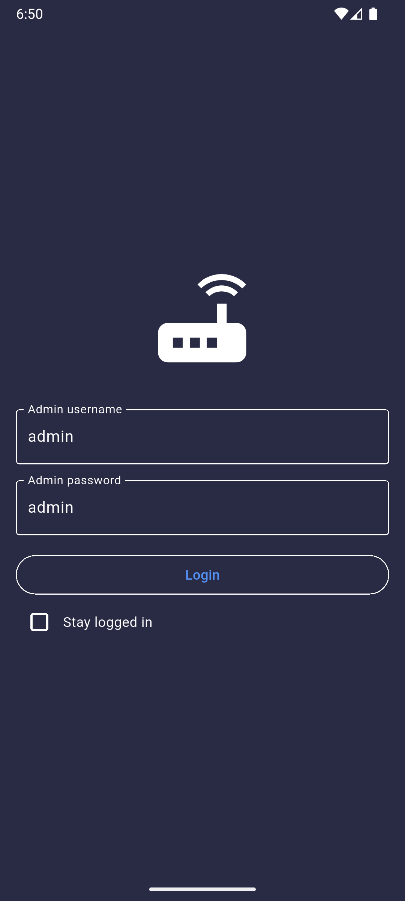
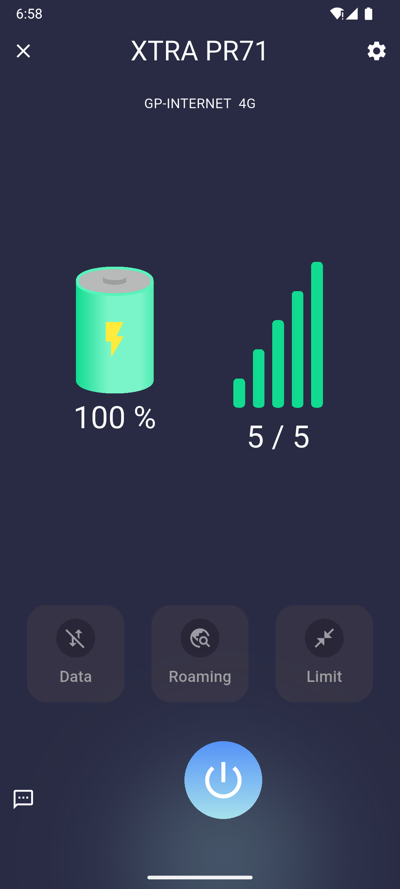
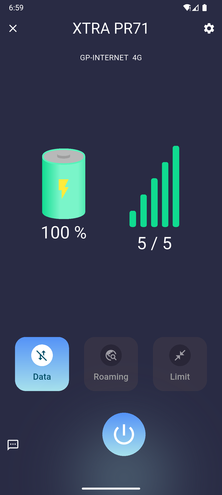
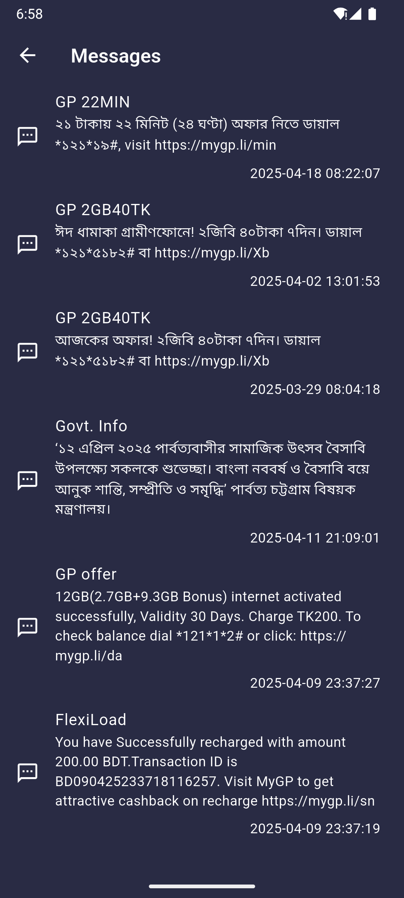
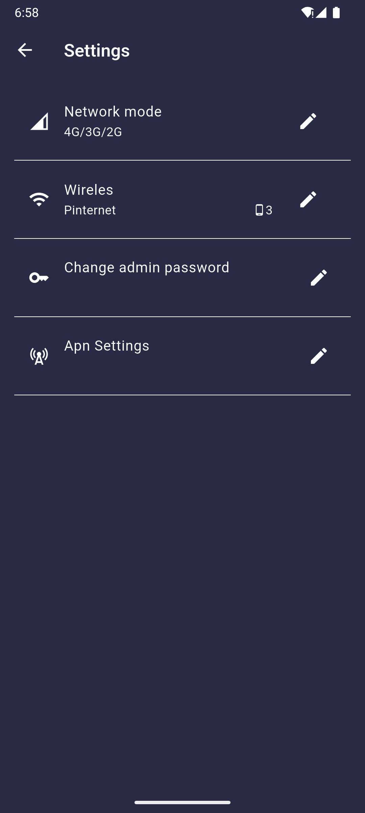

# XTRA PR71 Router Controller (Open Source) | ⚠️ Alpha v0.1.0

An open-source mobile application built with Flutter to control and manage XTRA PR71 pocket routers. This project is not affiliated with, endorsed by, or connected to the manufacturers of XTRA PR71 devices.

## ⚠️ Alpha Version Notice

This project is currently in **ALPHA** state (v0.1.0-alpha.1). Features may be incomplete, unstable, or subject to change. Use with caution and please report any issues you encounter.

## Features

- **Router Control**: Power off, restart, and reset your router remotely
- **Connection Management**: View and manage data connections
- **SMS Management**: Read and send SMS messages
- **User Authentication**: Secure login to protect your router access
- **Settings Configuration**: Customize router settings

## Screenshots

| Login                                     | Home (Data Disabled)                                                  | Home (Data Enabled)                                                 |
| ----------------------------------------- | --------------------------------------------------------------------- | ------------------------------------------------------------------- |
|  |  |  |

| SMS                                   | Settings                                        |
| ------------------------------------- | ----------------------------------------------- |
|  |  |

## Legal Notice

XTRA PR71 is a trademark of its respective owner. This application is an independent open-source project created to provide additional functionality for users of XTRA PR71 pocket routers. We are not affiliated with the manufacturer of XTRA PR71 devices.

## Getting Started

### For Users

#### Installation

1. Download the app from [Google Play Store](https://play.google.com/store/apps/details?id=com.srizan.xtra_pr_71) (coming soon)
2. Install the app on your Android device
3. Connect your device to the same network as your XTRA PR71 router
4. Launch the app and enter your router's login credentials

#### System Requirements

- Android 6.0 (Marshmallow) or higher
- Access to an XTRA PR71 pocket router
- Local network connection to your router

### For Developers

### Prerequisites

- Flutter SDK 3.5.4 or higher
- Android Studio / VS Code with Flutter plugins

### Installation

1. Clone this repository
2. Install dependencies:
   ```bash
   flutter pub get
   ```
3. Run the app:
   ```bash
   flutter run
   ```

## Technology Stack

- Flutter
- Bloc for state management
- Freezed for immutable data models
- Shared Preferences for local storage

## Development Status

The current version (0.1.0-alpha.1) is an early release with the following limitations:

- Some features may be incomplete or unstable
- The UI might undergo significant changes
- Regular updates are expected as development progresses
- Backwards compatibility is not guaranteed between alpha versions

We welcome feedback, bug reports, and contributions to help improve the application.

## Contributing

Pull requests are welcome. For major changes, please open an issue first to discuss what you would like to change.

## License

This project is licensed under the MIT License - see the LICENSE file for details.
