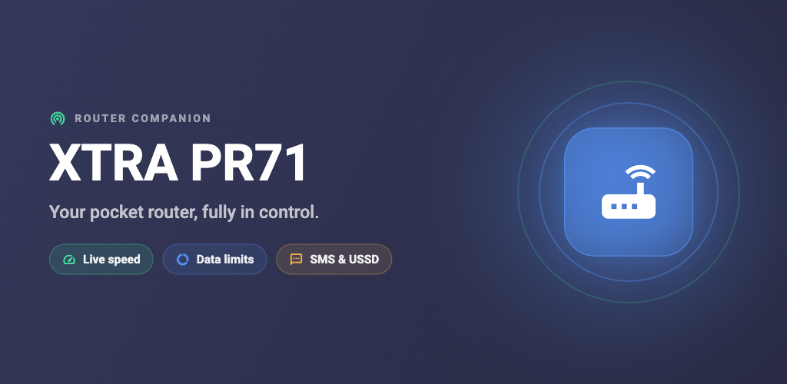
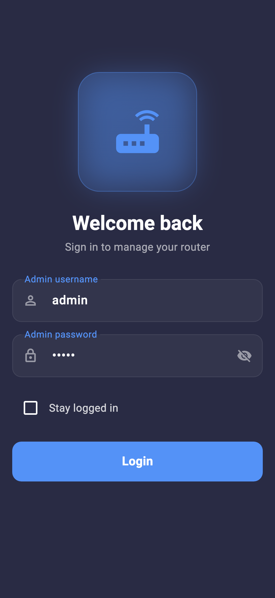
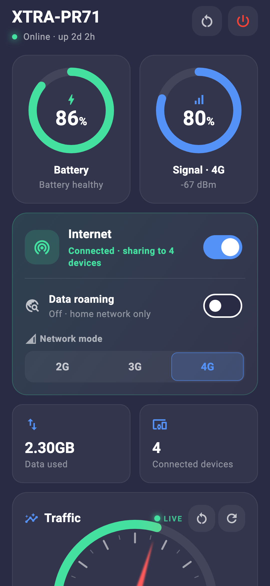
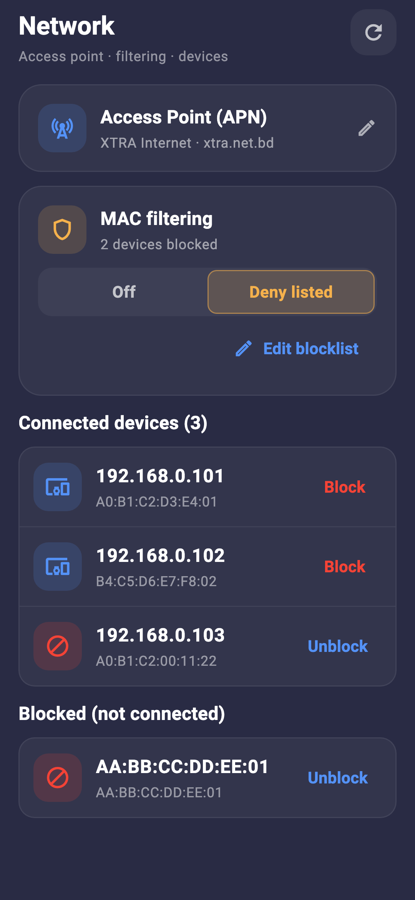
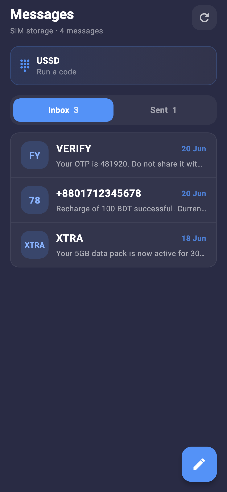
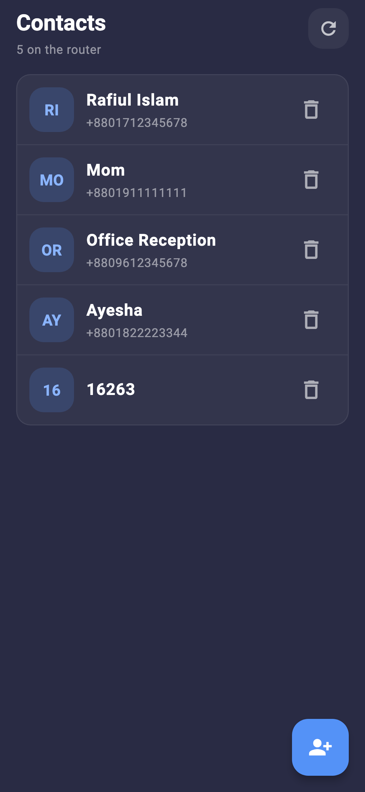
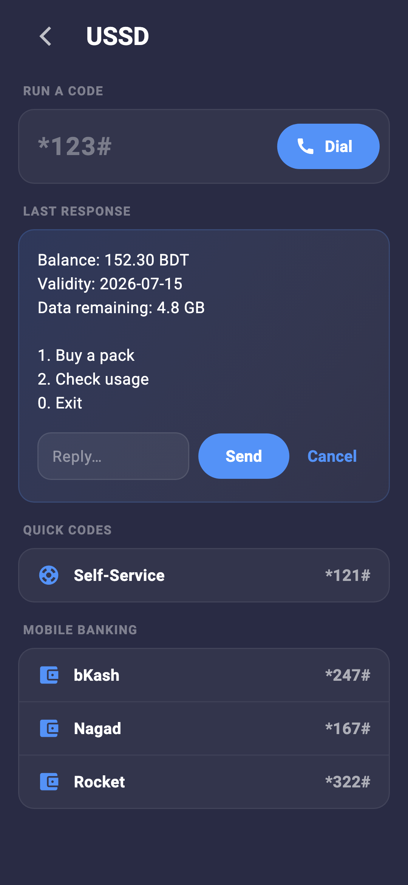

# XTRA PR71 Router Controller (Open Source) | Alpha v0.2.0



An open-source Flutter app to control and manage XTRA PR71 pocket routers. This project is not affiliated with, endorsed by, or connected to the manufacturers of XTRA PR71 devices.

## Alpha Version Notice

This project is currently in **ALPHA** state (`v0.2.0-alpha`). Features may be incomplete, unstable, or subject to change. Please report any issues you encounter.

## Features

- **Router Control**: Power off, restart, and reset your router remotely
- **Connection Management**: Enable/disable mobile data and monitor connection status
- **SMS Management**: Read and send SMS messages through your router's SIM card
- **Secure Login**: Credentials stored locally on-device — never sent to external servers
- **Settings Configuration**: Customize router settings from the app

## Screenshots

| Login | Home | Network |
| --- | --- | --- |
|  |  |  |

| Messages | Contacts | USSD |
| --- | --- | --- |
|  |  |  |

## Getting Started

### For Users

1. Download the APK from [GitHub Releases](https://github.com/srizanx/xtra_pr_71/releases)
2. Install on your Android device (Android 6.0 / Marshmallow or higher)
3. Connect your device to the same Wi-Fi network as your XTRA PR71 router
4. Launch the app and enter your router's login credentials

### For Developers

**Prerequisites**

- Flutter SDK 3.5.4 or higher
- Android Studio or VS Code with Flutter plugins

**Setup**

```bash
git clone https://github.com/srizanx/xtra_pr_71.git
cd xtra_pr_71
flutter pub get
flutter run
```

## Technology Stack

- **Flutter** — cross-platform UI framework
- **Bloc** — state management
- **Freezed** — immutable data models
- **Shared Preferences** — local credential storage

## Development Status

Current version: `0.2.0-alpha`

- Some features may be incomplete or unstable
- The UI may undergo significant changes between releases
- Backwards compatibility is not guaranteed between alpha versions

Bug reports, feature requests, and pull requests are welcome. For major changes please open an issue first.

## Legal Notice

XTRA PR71 is a trademark of its respective owner. This application is an independent open-source project and is not affiliated with the manufacturer of XTRA PR71 devices.

## Contributing

Pull requests are welcome. For major changes, please open an issue first to discuss what you would like to change.

## License

This project is licensed under the MIT License — see the LICENSE file for details.
